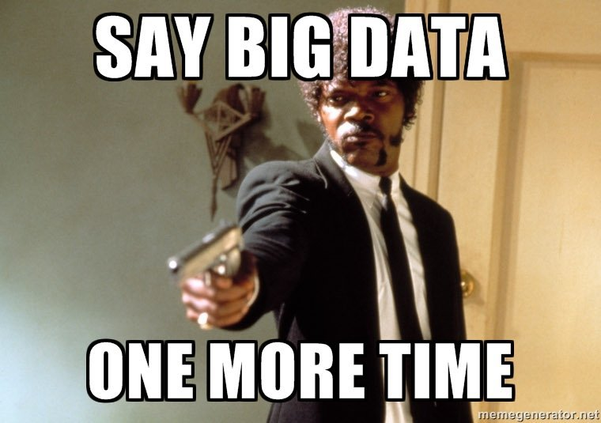

# big-data-people

## 1 - 11.10.2022

#### TODO: 

tensorflow bzw. python kennenlernen

- [Tensorflow Python Neural Network Tutorial](https://pythonprogramminglanguage.com/tensorflow-neural-network/)
- [Kaggle Titanic Competition](https://www.kaggle.com/competitions/titanic/discussion)
- [Python Back Propagation Course](https://python-course.eu/machine-learning/backpropagation-in-neural-networks.php)

* jeder schreibt ein python-tensorflow-fantasie-projekt
* vorstellen in woche 3

## 2 - 18.10.2022
* Besonderheiten/Bedürfnisse des Modells für die SKAO-Bilder identifizieren.
* Besonderheiten von Fast Radio Bursts als Signal identifizieren.
* [Miro-Board](https://miro.com/app/board/uXjVPMprpXc=/)
#### TODO:
- Miro-Board ergänzen
- Mit den verlinkten Materialien beschäftigen

#### 

## 3 - 25.10.2022
* evtl. Python-Tensorflow-Fantasie-Projekt vorstellen.
* Nach verwandten Werken suchen.

## 4 - 01.11.2022

## 5 - 08.11.2022

#### TODO:
* darstellung von erfolgreichen bzw. fehlerhaften klassifizierung
* aktivierung/loss mit tensorboard darstellen
* notebooks von rachael und henrik ([tutorial für mnist digit](https://machinelearningmastery.com/how-to-develop-a-convolutional-neural-network-from-scratch-for-mnist-handwritten-digit-classification/)) verstehen

## 6 - 15.11.2022
- 7 - 22.11.2022
- 8 - 29.11.2022
- 9 - 06.12.2022
- 10 - 13.12.2022
- 11 - 20.12.2022
- Weihnachten
- 12 - 03.01.2023
- 13 - 10.01.2023
- 14 - 17.01.2023
- 15 - 24.01.2023
- 16 - 31.01.2023
- 17 - 07.02.2023
